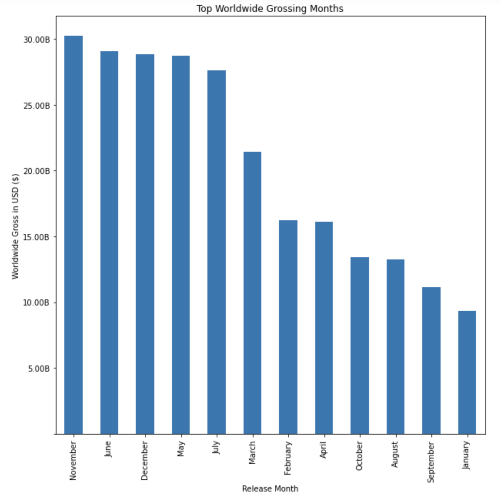
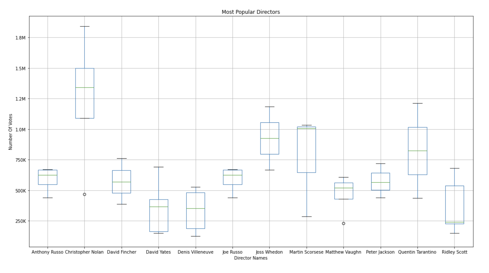
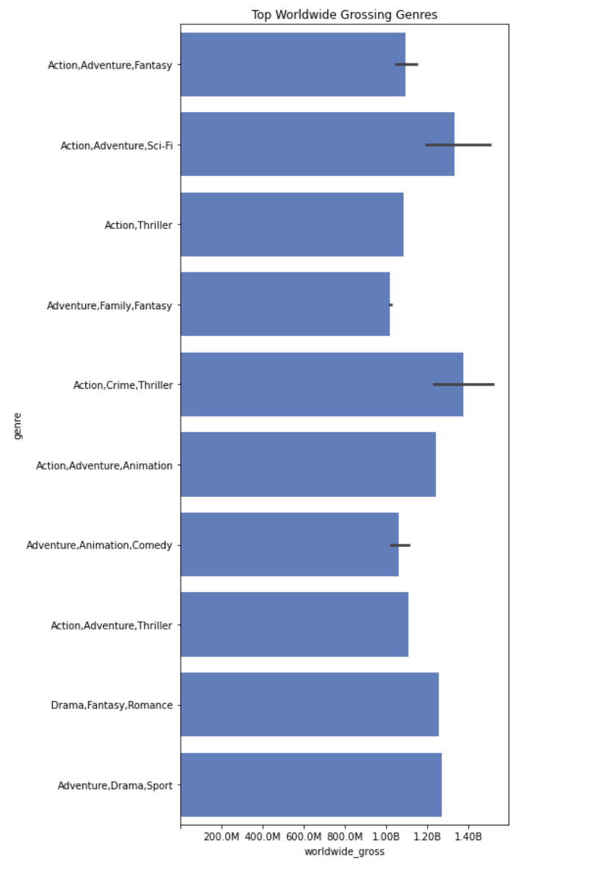

# Microsoft Movie Analysis
---

### Author: Michael Holthouser
---
## Overview 
---

I have been tasked with helping Microsoft in their new business venture into the movie industry. I think it is important to look at not only genres and release date, but also which actors and directors were voted the most popular.  After exploring the data, it seems that audiences really prefer movies of the action, adventure, science fiction genre, which makes sense with the recent surge of super hero movies. Although actors and directors are considered a soft data point and can't be described with a hard number, they are key to attracting the avid movie goers to come watch your film. I will also provide data and visualizations to show when the best time of year to release a film, profitable genres, and popular directors and actors. This analysis will ultimately provide the components that generate successful movies.

## Business Problem 
---

Microsoft has decided that it wants create a new movie studio, but they don't know where to begin. Having no prior experience in the movie business makes it very challenging indeed. To help Microsoft start off on the right foot, I will explore what movies have the highest worldwide gross since 2010 to get a good sense of what the public tends to like. I have investigated four aspects of box office movies to help assist Microsoft in making a good decision on what kind of movie to produce: 

- Release time: What time of the year promotes the highest worldwide gross?
- Directors: Which directors are the most popular in terms of number of votes? A good director is important to attract talented actors/actresses.
- Actors: Which actors should Microsoft target for their movie?
- Genres: What genre of movies do the best in the box office in terms of worldwide gross?

## The Data
---

### Movie Budgets - The Numbers
---
The Numbers was launched by Bruce Nash on 1997 as a free resource for industry professionals, the investment community, and movie fans to track business information on movies. The site has grown to become the largest freely-available database of movie business information on the web. The Numbers now brings information on over 50,000 movies and nearly 200,000 people to the broadest audience possible.

### IMDb dataset
---
The Internet Movie Database (IMDb) is an online database containing information and statistics about movies, TV shows and video games as well as actors, directors and other film industry professionals. Information on IMDb comes from a variety of sources, such as filmmakers, film studios, on-screen credits and other official sources. This database is accessed in this analysis using SQLite, so it had to be unzipped and then I performed queries to get my results. From this database, I will pull information about genres, actors, and directors. 

## Methods
---
I imported the data from my two sources. Luckily, the data from the The Numbers website was not missing data, so the cleaning portion of my analysis was pretty minimal. However, there was some formatting involved to the dataset to adjust the production budget, domestic gross, and to worldwide_gross columns to a float data type. This was necessary to be able to any perform mathematical operations. I also had to extract an extra data set from an IMDb database using SQL then looped that data into the movie budget data frame. With my data, I then created visualizations to better show my results so I could provide solid recommendations on how to create and when to release a successful movie. 

## Results
---

The highest grossing month to release a film was November. Releasing in the summer time is proven to also be a good time to release a film. 

Using number_of_votes as my factor for determining the most popular director, Christopher Nolan was the top option with the highest number of votes. 

Using number_of_votes again for determining the most popular actor since 2010, The data shows that Leonardo DiCaprio is the most popular. 

By adding a genre column to my recent_movie_budgets dataframe and populating it with the data from the IMDb database, adventure/crime/thriller was the highest grossing genre with action/adventure/sci-fi as a close second. 

## Conclusion
---
In conclusion, I would recommend that Microsoft create movies of either the action/crime/thriller genre or the action/adventure/sci-fi genre. From the data provided, hiring well known directors and actors is proven to positively impact the worldwide gross for a film. To promote the highest box office sales, I recommend a release date during the summer season or during the holidays in November and December. 
Movie genre, the hiring of a director and lead actor, and release month are all factors critical to creating a successful film. 


```python

```
